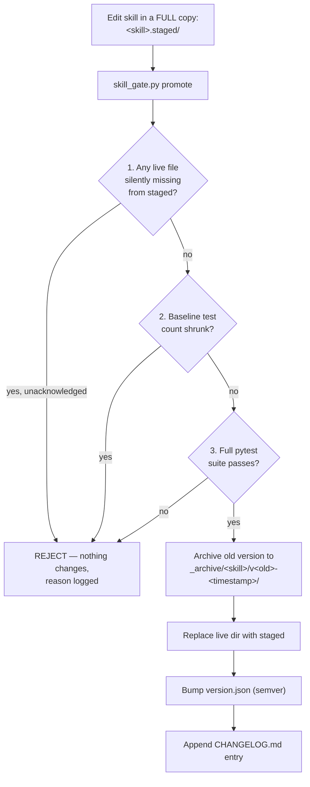

# Digital Agent Factory - Claude Code Instructions

**Project Type:** AI-Powered Development System with FTE Agents & Reusable Intelligence

---

## Core Philosophy

> **Specify first. Plan then. Implement with skills. Test always.**

This project follows three integrated methodologies:
1. **Spec-Driven Development (SDD)** - No code without specification
2. **AI-Driven Development (AIDD)** - AI agents orchestrate development
3. **Test-Driven Development (TDD)** - Quality built-in through testing

---

## Critical Rules for All Agents

### ⛔ Absolute Requirements

1. **NEVER generate code without a referenced Task ID**
2. **NEVER modify architecture without updating `speckit.plan`**
3. **NEVER propose features without updating `speckit.specify`**
4. **NEVER change principles without updating `speckit.constitution`**
5. **If spec is missing → STOP and request it** - DO NOT improvise

---

## Spec-Kit Workflow (Source of Truth)

### The SDD Loop
```
Constitution (WHY) → Specify (WHAT) → Plan (HOW) → Tasks (BREAKDOWN) → Implement (CODE)
```

| Phase | File | Purpose |
|-------|------|---------|
| **Constitution** | `speckit.constitution` | WHY — Principles, constraints, architecture values, security rules |
| **Specify** | `speckit.specify` | WHAT — Requirements, user journeys, acceptance criteria, domain rules |
| **Plan** | `speckit.plan` | HOW — Architecture, components, APIs, service boundaries |
| **Tasks** | `speckit.tasks` | BREAKDOWN — Atomic, testable work units with Task IDs |
| **Implement** | Code files | CODE — Implementation referencing Task IDs |

### File Hierarchy (in case of conflict)
```
Constitution > Specify > Plan > Tasks
```

---

## Working with Agents

### Available FTE Agents

**Master Orchestrator:**
- `orchestrator.md` - Analyzes prompts, maps skills, coordinates multi-agent workflows

**Specialist Agents:**
- `backend-developer.md` - APIs, auth, database integration
- `frontend-developer.md` - UI/UX with React, Next.js
- `fullstack-architect.md` - System design, architecture
- `database-engineer.md` - Schema, migrations, optimization
- `devops-engineer.md` - Infrastructure, deployment, monitoring
- `security-engineer.md` - OWASP, auth, vulnerability testing
- `qa-engineer.md` - Testing, quality assurance
- `uiux-designer.md` - Interface and experience design
- `github-specialist.md` - Git, CI/CD, code review
- `vercel-deployer.md` - Vercel deployment, Next.js optimization
- `data-engineer.md` - Data pipelines, ETL, analytics
- `technical-writer.md` - Docs, guides, API reference
- `cloud-architect.md` - AWS/GCP/Azure, Kubernetes
- `api-architect.md` - REST/GraphQL/gRPC, microservices
- `product-manager.md` - Requirements, roadmap, user stories

**Special Agents:**
- `live-skill-learner/` - Captures fixes and improvements, updates skills automatically

### How to Invoke Agents

When a user requests work:
1. Read the appropriate agent file from `/agents/`
2. Follow the agent's instructions and skill mappings
3. Use the agent's primary skills for implementation
4. Coordinate with other agents as needed

---

## Working with Skills

Skills are reusable intelligence stored in `/skills/` directory. Each skill contains:
- `SKILL.md` - Instructions, patterns, best practices
- Optional scripts, templates, examples

### Key Skill Categories

**Workflow & Planning:**
- `new-feature` - Scaffold spec, plan, tasks
- `change-management` - Manage spec updates
- `skill-creator` - Create new skills
- `prompt-analyzer` - Intent & skill mapping

**Security & Auth:**
- `jwt-authentication`, `password-security`, `user-isolation`

**Quality & Testing:**
- `edge-case-tester`, `qa-engineer`, `ab-testing`, `production-checklist`

**Infrastructure & Deployment:**
- `deployment-automation`, `aws-eks-deploy`, `azure-aks-deploy`, `gcp-gke-deploy`

**API & Design:**
- `api-contract-design`, `api-docs-generator`, `graphql-api`

### How to Use Skills

1. Check if a relevant skill exists in `/skills/`
2. Read the `SKILL.md` file
3. Follow the skill's instructions
4. Reference the skill in your implementation

---

## Code Implementation Rules

### When Generating Code

Every code file MUST contain comments linking to:
```python
# [Task]: T-001
# [From]: speckit.specify §2.1, speckit.plan §3.4
# [Skill]: jwt-authentication
```

### Code Generation Process

1. **Verify Task ID exists** in `speckit.tasks`
2. **Check referenced sections** in `speckit.specify` and `speckit.plan`
3. **Follow relevant skills** for implementation patterns
4. **Write code** with proper references
5. **Never freestyle** - stick to the spec

---

## Agent Behavior Patterns

### ✅ When Proposing Code
```
Reference: [Task]: T-001 from speckit.tasks
Implements: speckit.specify §2.1 (User authentication)
Architecture: speckit.plan §3.4 (JWT middleware)
Skill: jwt-authentication
```

### ✅ When Proposing Architecture Changes
```
⚠️ Update Required in speckit.plan
New Component: API Gateway
Reason: [explain architectural need]
Affects: [list impacted components]
```

### ✅ When Proposing New Features
```
⚠️ Update Required in speckit.specify
New Requirement: [describe feature]
User Journey: [explain user flow]
Acceptance Criteria: [define success]
```

### ✅ When Changing Principles
```
⚠️ Modify speckit.constitution
Principle Change: [describe change]
Rationale: [explain why]
Impact: [assess consequences]
```

---

## Prohibited Agent Behaviors

### ⛔ NEVER Do This

- ❌ Freestyle code or architecture
- ❌ Generate missing requirements
- ❌ Create tasks independently
- ❌ Alter tech stack without justification
- ❌ Add endpoints/fields/flows not in spec
- ❌ Ignore acceptance criteria
- ❌ Produce "creative" implementations violating the plan
- ❌ Skip spec updates when proposing changes

---

## Development Workflow

### For New Features

1. **User Request** → Analyze intent
2. **Check Spec-Kit** → Does spec exist?
3. **If No Spec:**
   - Use `new-feature` skill to scaffold
   - Create: `speckit.constitution`, `speckit.specify`, `speckit.plan`, `speckit.tasks`
   - Get user approval
4. **If Spec Exists:**
   - Read constitution, specify, plan, tasks
   - Identify relevant agents and skills
   - Implement according to tasks
5. **Testing:**
   - Use `edge-case-tester` skill
   - Run `qa-engineer` checks
   - Validate with `production-checklist`
6. **Continuous Learning:**
   - `live-skill-learner` captures improvements
   - Skills updated for future use

### For Modifications

1. **Read existing spec-kit files**
2. **Determine what needs updating:**
   - Constitution? (principles changed)
   - Specify? (requirements changed)
   - Plan? (architecture changed)
   - Tasks? (work breakdown changed)
3. **Update spec-kit first**
4. **Then implement code changes**
5. **Update tests**

---

## Directory Structure

```
digital_factory/
├── .claude/
│   ├── CLAUDE.md           # This file - instructions for Claude
│   ├── ignore              # Files to ignore
│   └── project.json        # Project metadata
├── agents/                 # FTE Agent definitions (16+ agents)
│   ├── orchestrator.md
│   ├── backend-developer.md
│   ├── frontend-developer.md
│   └── ... (15+ more)
├── skills/                 # Reusable Intelligence (40+ skills)
│   ├── new-feature/
│   ├── api-contract-design/
│   ├── jwt-authentication/
│   └── ... (40+ more)
└── README.md              # Project overview
```

---

## Session Initialization

Before every session, read:
1. `.claude/CLAUDE.md` (this file)
2. Relevant agent files from `/agents/`
3. Relevant skill files from `/skills/`
4. Spec-Kit files if they exist:
   - `speckit.constitution`
   - `speckit.specify`
   - `speckit.plan`
   - `speckit.tasks`

---

## Integration with AI-Driven Development

### Orchestrator Pattern

When user gives a prompt:
1. **Orchestrator analyzes** → Intent detection
2. **Maps to skills** → Which skills apply?
3. **Assigns agents** → Which specialists needed?
4. **Creates execution plan** → Sequential or parallel?
5. **Waits for approval** → User confirms
6. **Coordinates execution** → Agents execute tasks

### Multi-Agent Coordination

Complex features may require:
- **Parallel execution:** Independent tasks (frontend + backend)
- **Sequential execution:** Dependent tasks (schema → API → tests)
- **Skill chaining:** One skill's output feeds another

---

## Quality Gates

Before marking any feature complete:

✅ **Spec Compliance**
- All code references Task IDs
- Implementation matches Plan
- Requirements from Specify are met

✅ **Testing**
- Unit tests written and passing
- Edge cases covered (`edge-case-tester`)
- Production checklist validated

✅ **Documentation**
- API docs generated (`api-docs-generator`)
- Code comments reference specs
- Skills updated if new patterns learned

---

## Emergency Scenarios

### Spec Missing or Incomplete
```
⚠️ STOP - Specification Required

Missing: [constitution/specify/plan/tasks]
Cannot proceed without: [explain what's needed]
Recommend: Use `new-feature` skill to scaffold

❓ Should I create the spec now? [yes/no]
```

### Spec Conflict
```
⚠️ Spec Conflict Detected

Conflict between: speckit.specify §X and speckit.plan §Y
Issue: [describe contradiction]
Resolution needed before proceeding

Hierarchy: Constitution > Specify > Plan > Tasks
```

### Task Underspecified
```
⚠️ Task T-XXX Underspecified

Missing: [preconditions/outputs/acceptance criteria]
Cannot implement without clarification

❓ Please clarify: [specific questions]
```

---

## Benefits of This Approach

| Benefit | How Achieved |
|---------|--------------|
| **No Vibe Coding** | SDD ensures specs exist before code |
| **Consistent Quality** | Skills embed best practices; TDD enforces coverage |
| **Faster Development** | Right agents/skills chosen automatically (AIDD) |
| **Compounding Intelligence** | `live-skill-learner` keeps skills improving |
| **Scalability** | New agents/skills added without changing core flow |
| **Traceability** | Every line of code traces to spec |
| **Predictability** | Deterministic development process |

---

## Quick Reference

### User Commands
```bash
# Invoke orchestrator (recommended)
"Build feature X with Y requirements"

# Use specific agent
Use agent: backend-developer, frontend-developer, etc.

# Use specific skill
Use skill: new-feature, api-contract-design, edge-case-tester
```

### File References
```
Constitution: speckit.constitution
Requirements: speckit.specify
Architecture: speckit.plan
Work Units: speckit.tasks
```

---

**Remember:** Specify first. Plan then. Implement with skills. Test always. 🚀

---

## 🧠 Skill Versioning & Regression Gate — Lessons Learned (added 2026-09-14)

This section documents a real incident, the fix, and hard rules for any future AI
assistant (or human) working in `.claude/skills/`. Read this before touching any
skill's `scripts/tool.py` or `tests/`.

### Why this section exists

A LinkedIn commenter (Ammar Zaky, Senior Software Engineer) reviewed this repo and
wrote:

> "I'd version each skill and test changes against a fixed set of cases before
> replacing the working version. Letting the agent rewrite both its instructions
> and its tests makes it too easy to mistake a weaker test for an improvement."

An audit confirmed he was right: `grafana-expert` and `prometheus-monitoring` had
a genuinely useful, 6-distinct-check test suite silently replaced by a much
weaker one during an earlier "Expert-Level Automation" upgrade pass
(dated 2026-02-11 in the skill headers). Nobody caught it because there was no
fixed baseline to check the new tests against. Separately, most of the ~36
"Expert-Level Automation" skills were pure `# TODO: Implement X` stubs —
contradicting this project's own TDD claims in the README.

### The architecture (how the gate works)

`.claude/skills/_framework/skill_gate.py` is now the **only sanctioned path** to
promote any change to a skill's `scripts/tool.py` or its `tests/`.



Flow:
1. Copy the **entire** live skill directory to a sibling `<skill>.staged/` (not
   just the files you're changing) and make your edits there.
2. Run:
   ```
   python3 .claude/skills/_framework/skill_gate.py promote \
     --skill <name> --staged-dir .claude/skills/<name>.staged \
     --bump [patch|minor|major] --reason "..."
   ```
3. The gate checks, in order, and REJECTS the promotion (live skill untouched) if
   any check fails:
   - **File-loss safeguard** (`_unexplained_missing_files`): staged dir is
     missing a top-level file/folder that exists live (e.g. `README.md`,
     `EXAMPLES.md`, `examples/`) and `--allow-file-removal` was not passed.
   - **Test-set-never-shrinks check** (`_test_ids_defined`): fewer `def test_*`
     functions in staged than in live.
   - **Regression check** (`_run_pytest`): the staged test suite must pass in full.
4. Only if all three pass: archive → replace → bump version → changelog.
5. `skill_gate.py check --skill <name>` dry-runs the checks without promoting.
6. The gate's own meta-tests live in
   `.claude/skills/_framework/tests/test_skill_gate.py` (6 tests proving it
   actually rejects what it should reject).

Full write-up: `.claude/docs/skill-versioning-policy.md`.

### What worked

- Writing genuinely dependency-free, testable pure functions for every skill
  (SHA256 deterministic bucketing, two-proportion z-tests, PBKDF2 password
  hashing, hand-rolled HS256 JWT, WCAG contrast math, wait-for-graph deadlock
  detection, circuit breaker + saga state machines) instead of TODO stubs.
  39 skill promotions (37 stub→real + 2 regression fixes) now each carry a real
  `tests/test_tool.py`. **346 tests pass repo-wide** as of 2026-09-14
  (`python3 -m pytest --import-mode=importlib .claude/skills -q`).
- `importlib.util.spec_from_file_location(...)` with a **per-skill-unique module
  name** in every `tests/test_tool.py`, plus `--import-mode=importlib` on every
  pytest invocation. Necessary because dozens of `tests/test_tool.py` files
  share the same basename with no `__init__.py` — pytest's default import mode
  collides across them. Without this, running the whole `.claude/skills` tree's
  tests together threw ~12 collection errors.
- Archiving the previous version before replacing it — a real rollback path,
  not just a changelog line.
- Showing the user the full `git diff --stat` / `git status` summary before ANY
  push, and asking explicit confirmation on ambiguous items (stale backup
  folders, local-machine-only files) instead of guessing.

### What did NOT work / failures encountered

1. **The original regression** (why this system exists at all): a real test
   suite quietly replaced by a weaker one, undetected for 6+ months, with no
   versioning to catch it.
2. **Near-miss file loss during the fix itself:** while staging
   `grafana-expert`, `prometheus-monitoring`, and `prompt-analyzer`, only
   `SKILL.md` was copied into `.staged/` — not the whole live directory. The
   (pre-safeguard) gate replaced the live dir with that incomplete copy,
   silently deleting `README.md` (x2) and a 372-line `EXAMPLES.md`. Caught
   ONLY because of the "show the diff before pushing" review step. Fixed by
   restoring the files from the gate's own `_archive/` snapshots and building
   the permanent `_unexplained_missing_files` safeguard (with tests). That
   safeguard then immediately caught a real repeat with
   `database-schema-expander`'s `examples/` directory later the same session.
3. **`device_bash` cannot delete files by default** in a connected folder
   (`PermissionError: Operation not permitted`) until
   `device_request_delete_permission` is granted for that folder.
4. **Regex word-boundary bugs are easy to introduce, easy to miss without
   tests:** `\btest\b` not matching plural "tests" (`prompt-analyzer`); `\b`
   immediately after an operator like `=` failing when followed by whitespace
   (`database-engineer`'s `suggest_indexes`). Both caught only because a
   written-first test exercised the exact tricky input.
5. **Unconditional cleanup mid-pipeline is dangerous:** an `rm -rf
   <skill>.staged` that ran without checking whether `promote` actually
   succeeded once deleted real staged work after a correctly-rejected promotion
   (`database-schema-expander`). Adopted for the rest of the rollout: always
   chain `promote ... && rm -rf .staged`.
6. **pytest was not preinstalled** in this environment —
   `python3 -m pip install --user pytest`, then
   `export PATH="$HOME/.local/bin:$PATH"`.
7. **`git push` from a sandboxed shell needs an explicit credential** — no
   saved GitHub credential helper or `~/.netrc` here. A Personal Access Token
   inline in the remote URL (`https://<token>@github.com/...`) works; plain
   `git push origin main` fails with a confusing "No such device or address" /
   "could not read Username" rather than a clear auth prompt. Never ask for or
   store a token beyond the single push it's needed for — advise the user to
   revoke it immediately after.

### Dos

- ✅ Always stage a **full copy** of the live skill directory before editing —
  then let the gate diff-check it.
- ✅ Always promote through `skill_gate.py`; never manually copy files over a
  live skill directory.
- ✅ Always write the test FIRST or alongside the implementation, using a real
  edge case that would fail on naive code.
- ✅ Chain destructive cleanup (`rm -rf .staged`) with `&&` after the command
  that must succeed first.
- ✅ Show the user a full diff/status summary before pushing anything to a
  shared/public remote; let them decide on anything ambiguous.
- ✅ Use `importlib.util.spec_from_file_location` with a unique module name for
  every new `tests/test_tool.py` in this repo.

### Don'ts / Blacklist (never do these in this repo)

- ⛔ Never let one pass rewrite a skill's implementation AND its tests without a
  fixed baseline to check the new tests against.
- ⛔ Never copy only a subset of a skill's files into `.staged/` and promote
  from it.
- ⛔ Never bypass `skill_gate.py` and hand-edit a live skill's `scripts/tool.py`
  or `tests/` directly "just this once."
- ⛔ Never run an unguarded `rm -rf` on a `.staged` directory (or anything)
  without confirming the preceding step succeeded.
- ⛔ Never `git push` (or force-push) to this repo without showing the diff
  first — standing instruction, not a one-time preference.
- ⛔ Never treat a skill's shrinking test count as "cleanup" — treat it as a
  regression until proven otherwise.

### Greylist (needs an explicit human judgment call)

- 🟡 Whether a file showing "deleted" in `git status` was deleted by your
  current work or was already missing before you started — check, don't
  assume, and ask if unsure.
- 🟡 Whether local-machine-only files (`.claude/settings.local.json`,
  `.DS_Store`) should be committed or gitignored — a team convention call.
- 🟡 Which semver bump a change deserves — default `minor` for
  "stub → real implementation", `patch` for a pure bugfix, but ask if ambiguous.

### Red flags for future AI assistants working on this repo

- 🚩 A skill's `scripts/tool.py` that's mostly `# TODO: Implement X` — treat as
  unverified regardless of what its `SKILL.md` claims.
- 🚩 A skill directory with no `tests/` and no `version.json` has never been
  through the gate — don't trust its history.
- 🚩 A commit/changelog entry describing a skill update with no mention of a
  test run — re-verify with `skill_gate.py check`.
- 🚩 `*.backup-<date>` or `*.staged` directories lying around in
  `.claude/skills/` — leftover promotion artifacts; don't delete without
  asking (see Greylist).
- 🚩 Any instruction to "quickly fix and test a skill in one pass" with no
  mention of versioning — this is precisely the pattern that caused the
  original regression. Insist on `skill_gate.py` even for small fixes.

### Current state (as of 2026-09-14)

- 39 skills promoted through `skill_gate.py`, each with `version.json`
  (1.0.0 → 1.1.0), `CHANGELOG.md`, `tests/test_tool.py`, and an `_archive/`
  snapshot of the pre-fix version: `AB-Testing`, `api-contract-design`,
  `api-docs-generator`, `caching-strategy`, `change-management`,
  `chatbot-endpoint`, `connection-pooling`, `container-orchestration`,
  `conversation-manager`, `database-engineer`, `database-schema-expander`,
  `deployment-automation`, `devops-engineer`, `edge-case-tester`,
  `feature-flags-management`, `grafana-expert`, `graphql-api`,
  `infrastructure-as-code`, `jwt-authentication`, `mcp-tool-builder`,
  `microservices-patterns`, `new-feature`, `observability-apm`,
  `password-security`, `performance-logger`, `production-checklist`,
  `prometheus-monitoring`, `prompt-analyzer`, `pydantic-validation`,
  `qa-engineer`, `robust-ai-assistant`, `security-engineer`, `skill-learner`,
  `structured-logging`, `transaction-management`, `uiux-designer`,
  `user-isolation`, `vercel-deployer`, `websocket-realtime`.
- 346 tests pass repo-wide.
- Any skill not in the list above and not touched since 2026-09-14 predates
  this system — audit it with `skill_gate.py check` before trusting it.

## 🔒 Guardrail Hardening — Closing the "same name, weaker assertion" gap (added 2026-09-16)

### Why this section exists

The original gate (above) checks that the **test count** never shrinks and that
the **staged suite passes**. It does not check whether an *existing* test's
body was quietly weakened while its name and assertion count stayed the same
— e.g. changing `assert result == 42` to `assert result is not None`. An
agent (or a human) could keep a test's name and even keep the total assert
count identical, and this specific attack would slip through the original
three checks undetected. This was flagged as an open risk during a review of
the gate itself, and the following mechanisms close it.

Seven mitigations were considered; **#7 (GitHub branch protection) was
deliberately NOT implemented** — it was rejected as out of scope for this
repo (a solo-maintainer project) and can be added later at the GitHub repo
settings level without any code change if that ever becomes useful.

### The four new checks (all inside `skill_gate.py promote`)

1. **Test-body hashing** (`_parse_test_functions`, stored as `test_baseline`
   in `version.json`): for every `def test_*` function, an AST-exact-source
   SHA256 hash plus its `ast.Assert` count is recorded per `test_id`
   (`"test_tool.py::test_name"`). On every promotion, if an *existing*
   `test_id`'s hash changed, the gate REJECTS unless you explicitly pass
   `--acknowledge-test-change <test_id>` (or `--acknowledge-test-change all`)
   **and** `--change-reason "..."`. This is the direct fix for the gap above:
   a test can no longer be silently reworded/weakened under its own name.
2. **Coverage-never-shrinks** (`_measure_coverage`, stored as `coverage_pct`):
   uses the `coverage` package to measure line coverage of `scripts/tool.py`
   under the staged test suite. A promotion that would drop coverage by more
   than 0.5 points is REJECTED unless `--allow-coverage-drop` is passed.
   Applies to **all** skills.
3. **Golden-file lock** (`_check_golden` / `golden.json`) — **security-critical
   skills only** (`SECURITY_CRITICAL_SKILLS = {"jwt-authentication",
   "password-security", "user-isolation"}`): the entire byte content of
   `tests/test_tool.py` is hash-locked. ANY change at all to that file
   requires `--acknowledge-golden-change` **and** `--change-reason "..."`.
   Deliberately stricter than #1 for these three skills because the cost of a
   silently weakened auth/password/isolation test is much higher than for a
   typical skill.
4. **Mutation testing** (`_mutation_score` / `_mutation_sites` /
   `_apply_mutation`) — **security-critical skills only**: deliberately
   injects small bugs into `scripts/tool.py` (comparison-operator flips,
   boolean-literal negation — one mutant at a time, up to 20 mutants) and
   checks whether the staged test suite "kills" each mutant (causes a test
   failure). The resulting kill-score (0.0–1.0) is stored as `mutation_score`.
   A promotion that would lower the score is REJECTED unless
   `--allow-mutation-drop`. This is a lightweight, practical subset of
   mutation testing (not exhaustive) — reserved for these three skills only,
   because running it repo-wide would make every promotion noticeably slower
   for little added value on non-security skills.

Baseline values for all 39 already-promoted skills were backfilled on
2026-09-16 with no implementation change (`test_baseline` + `coverage_pct`
for all 39; `mutation_score` additionally for the 3 security-critical
skills) — see each skill's `CHANGELOG.md` "(baseline refresh)" entries.

### CI / pre-commit enforcement (#6) — closing the "bypass the gate entirely" hole

All of the above only matters if `skill_gate.py promote` is actually used.
Nothing previously stopped a direct hand-edit of a skill's `scripts/` or
`tests/` followed by a plain `git commit`, skipping the gate altogether.
`.claude/skills/_framework/ci_gate_check.py` closes this: it inspects the
changed files (staged files for a pre-commit hook, or the diff vs. a base ref
in CI) and BLOCKS whenever a skill's `scripts/` or `tests/` changed without
that same skill's `version.json` also changing in the same diff — which is
only possible via `skill_gate.py promote`.

Wired in two places:
- **Local pre-commit hook**: `.pre-commit-config.yaml` (repo root) runs
  `ci_gate_check.py --staged` on every commit attempt. Requires `pre-commit`
  installed and `pre-commit install` run once per clone — this is a
  convenience net for a human/agent working locally, not the enforcement
  boundary of record.
- **GitHub Actions**: `.github/workflows/skill-gate-ci.yml` runs on every PR
  touching `.claude/skills/**`: re-runs the full 346-test suite, then runs
  `ci_gate_check.py --base origin/<base-branch>`. This is the enforcement
  boundary that actually matters for a shared repo, since a local hook can be
  skipped with `--no-verify` but a required CI check on a PR cannot (once
  branch protection requires it — see the #7 note above: this repo does not
  currently require it, so today this workflow reports status but does not
  block a merge by itself).

### What these guardrails protect, and what they don't (agents vs. skills)

- These checks apply to **skills** (`.claude/skills/<name>/scripts/tool.py`
  and `tests/`) — not to **agents** (`.claude/agents/*.md`). Agents are
  role/persona instructions (e.g. `backend-developer`, `security-engineer`);
  they aren't versioned or gated by this system because they don't have a
  "passing test suite" the way a skill's implementation code does.
- **Skills are fully reusable** in any future project — copy the skill
  directory (including its `scripts/`, `tests/`, `version.json`, the whole
  gate mechanism) as-is; the tests/implementation are domain-independent
  utility code (JWT encode/verify, password hashing, deadlock detection,
  etc.).
- **Agents are reusable only insofar as the new project is also a software
  engineering project.** A technical role like `backend-developer` or
  `qa-engineer` isn't tied to this specific business domain and would work
  in most other software projects; a domain-specific agent would need to be
  authored fresh for a genuinely different kind of project (e.g. a
  non-software business). Either way, the skill-versioning gate and its new
  guardrails travel with the skills, not with any particular agent.

### Dos (guardrail-specific, in addition to the Dos above)

- ✅ When a test genuinely needs to change (not just its name — its actual
  assertions), always pass both `--acknowledge-test-change <test_id>` and a
  real `--change-reason` explaining *why* the assertion changed — never
  `--acknowledge-test-change all` as a reflex to silence the check.
- ✅ For the 3 security-critical skills, treat a `golden.json` mismatch as a
  stop-and-explain moment, not a rubber-stamp `--acknowledge-golden-change`.
- ✅ Re-run `skill_gate.py check` after any promotion involving these new
  flags to confirm the new baseline was actually written.

### Don'ts (guardrail-specific)

- ⛔ Never pass `--acknowledge-test-change all` or
  `--acknowledge-golden-change` without a specific, honest `--change-reason`
  — these flags exist to force a paper trail, not to be routinely bypassed.
- ⛔ Never treat a dropping `mutation_score` or `coverage_pct` on a
  security-critical skill as acceptable "for now" — these three skills are
  exactly the ones where a regression matters most.


## 🆕 New-Skill Onboarding Gate — a one-time, stricter bar for a skill's first commit (added 2026-09-18)

### Why this section exists

The guardrails above (test-body hashing, coverage-never-shrinks, mutation
testing, golden-file lock) all fire inside `skill_gate.py promote` — they
protect a skill that is already in the repo from *regressing*. None of them
say anything about how solid a **brand-new** skill has to be before it is
allowed in at all. Without a check at that point, a new skill could be
committed with a stub implementation, 1-2 trivial tests, and no
`CHANGELOG.md`/`version.json`, and nothing would stop it — the existing gate
has no `init`/`create` subcommand, so a skill's first-ever commit was
previously unguarded. `new_skill_gate.py` closes that gap with a one-time,
stricter-than-ongoing check that runs only at onboarding.

### What it checks (`.claude/skills/_framework/new_skill_gate.py`)

For a skill directory being added for the first time, `run_new_skill_checks`
verifies, in order:

1. **Required files present**: `SKILL.md`, `scripts/tool.py`,
   `tests/test_tool.py`, `version.json`, `CHANGELOG.md`. Missing any of these
   is an immediate BLOCK — a skill without a real implementation file or a
   first `CHANGELOG.md` entry is not a finished skill.
2. **Recommended files** (`examples/`, `README.md`) — checked and reported,
   but **non-blocking**: these are noted as a warning in the report, not a
   reason to reject, since not every skill needs examples or its own README.
3. **Minimum test count**: at least `MIN_TESTS = 5` `def test_*` functions in
   `tests/test_tool.py` (via `skill_gate._parse_test_functions`).
4. **All tests pass**: a real `pytest` run against the skill's own
   `tests/` directory must exit 0.
5. **Coverage threshold**: `_measure_coverage` (the same function `promote`
   uses) must report at least `MIN_COVERAGE = 95.0`% line coverage of
   `scripts/tool.py`.
6. **Mutation-score threshold**: `_mutation_score` must report at least
   `MIN_MUTATION = 90.0`% (up to `MAX_MUTANTS = 30` mutants). Unlike the
   ongoing gate, mutation testing runs for **every** new skill here, not
   just the 3 security-critical ones — since this only happens once per
   skill (at onboarding), the extra cost is worth it for every skill.

Any failed check becomes a specific line in `report["reasons"]"`, and the
check never raises for an expected failure — a missing file or a failing
test produces a clear BLOCKED reason, not a crash.

### The "strength score"

`format_report` reports a skill's **strength score = its mutation score**,
deliberately **not** a blended average with coverage. The reasoning (per the
user's own question about whether these are "the same thing"): coverage
tells you how much of the code *ran* during the tests; mutation score tells
you whether the tests would actually *notice* if that code broke. A skill
can have 100% coverage with tests that never assert anything meaningful —
mutation score is what actually measures how "strong / solid / tough" the
test suite is, so it is the number reported as the skill's strength
percentage, with coverage shown alongside it as a separate, supporting
figure.

### Are unit tests and edge-case tests the same thing?

No — they answer different questions. A **unit test** exercises a function's
main, expected ("happy path") behavior in isolation. An **edge-case test**
targets the boundaries and unusual inputs around that behavior — exact
threshold values (e.g. a token at *exactly* its expiry second), malformed or
partial input the happy path never produces, and adversarial input designed
to find the one condition the implementation gets wrong. Both are "unit
tests" in the broad sense (they test one unit in isolation), but a suite of
only happy-path unit tests routinely reaches high coverage while still
having a low mutation score, precisely because it never touches the
boundaries where off-by-one and logic-inversion bugs actually hide. This
gate requires both: `MIN_TESTS` alone would accept a suite of 5 happy-path
tests; the coverage and mutation thresholds are what force edge-case
coverage in practice.

### Wired into `ci_gate_check.py`

`ci_gate_check.py` now does two things instead of one:

- **Existing-skill check (unchanged)**: any skill whose `scripts/` or
  `tests/` changed without a matching `version.json` bump is BLOCKED — this
  is the original bypass-detection check.
- **New-skill check (added)**: any skill whose `version.json` was added
  (git status `A`, not `M`) is treated as a brand-new skill and run through
  `new_skill_gate.run_new_skill_checks`. The full report — PASS with the
  strength score and every measured number, or BLOCKED with every specific
  missing file/threshold — is printed to stdout either way, so a human (or
  an agent) always sees *why* a new skill passed or failed, never just a bare
  exit code.

This runs automatically on every commit via `.pre-commit-config.yaml` and in
CI via `.github/workflows/skill-gate-ci.yml` — no separate invocation is
needed to get onboarding protection; adding a new skill and committing it is
enough to trigger the check.

### Dos and Don'ts (new-skill onboarding)

- ✅ Build a new skill's real `scripts/tool.py` implementation and
  `tests/test_tool.py` (with genuine edge cases, not just happy-path tests)
  *before* the first commit — the gate checks the whole directory at once,
  not incrementally.
- ✅ Read the printed report on a BLOCKED new skill — it names the exact
  missing file, the exact test count shortfall, or the exact coverage/
  mutation number that fell short, so there is never a need to guess why it
  failed.
- ✅ Treat `examples/`/`README.md` warnings as genuinely optional — only the
  five required files plus the three numeric thresholds are blocking.
- ⛔ Never write shallow or "gamed" tests (assertions that always pass, or
  that duplicate the happy path under a different name) just to clear
  `MIN_TESTS` or the coverage/mutation thresholds — that defeats the entire
  purpose of this gate, which exists specifically to keep weak test suites
  out of the repo.
- ⛔ Never hand-assemble a staged skill directory by cherry-picking files
  from an example — copy a real, complete skill structure first, then edit,
  so nothing required is accidentally missing.
