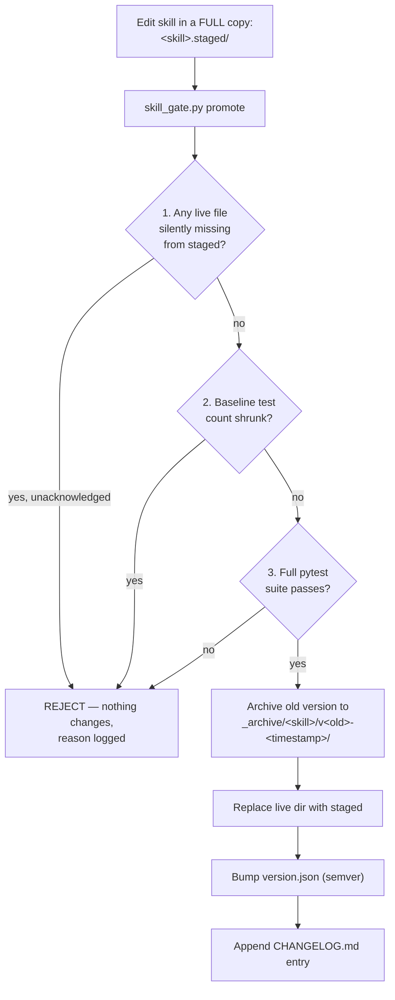

# Digital Agent Factory - Claude Code Instructions

**Project Type:** AI-Powered Development System with FTE Agents & Reusable Intelligence

---

## Core Philosophy

> **Specify first. Plan then. Implement with skills. Test always.**

This project follows three integrated methodologies:
1. **Spec-Driven Development (SDD)** - No code without specification
2. **AI-Driven Development (AIDD)** - AI agents orchestrate development
3. **Test-Driven Development (TDD)** - Quality built-in through testing

---

## Critical Rules for All Agents

### ⛔ Absolute Requirements

1. **NEVER generate code without a referenced Task ID**
2. **NEVER modify architecture without updating `speckit.plan`**
3. **NEVER propose features without updating `speckit.specify`**
4. **NEVER change principles without updating `speckit.constitution`**
5. **If spec is missing → STOP and request it** - DO NOT improvise

---

## Spec-Kit Workflow (Source of Truth)

### The SDD Loop
```
Constitution (WHY) → Specify (WHAT) → Plan (HOW) → Tasks (BREAKDOWN) → Implement (CODE)
```

| Phase | File | Purpose |
|-------|------|---------|
| **Constitution** | `speckit.constitution` | WHY — Principles, constraints, architecture values, security rules |
| **Specify** | `speckit.specify` | WHAT — Requirements, user journeys, acceptance criteria, domain rules |
| **Plan** | `speckit.plan` | HOW — Architecture, components, APIs, service boundaries |
| **Tasks** | `speckit.tasks` | BREAKDOWN — Atomic, testable work units with Task IDs |
| **Implement** | Code files | CODE — Implementation referencing Task IDs |

### File Hierarchy (in case of conflict)
```
Constitution > Specify > Plan > Tasks
```

---

## Working with Agents

### Available FTE Agents

**Master Orchestrator:**
- `orchestrator.md` - Analyzes prompts, maps skills, coordinates multi-agent workflows

**Specialist Agents:**
- `backend-developer.md` - APIs, auth, database integration
- `frontend-developer.md` - UI/UX with React, Next.js
- `fullstack-architect.md` - System design, architecture
- `database-engineer.md` - Schema, migrations, optimization
- `devops-engineer.md` - Infrastructure, deployment, monitoring
- `security-engineer.md` - OWASP, auth, vulnerability testing
- `qa-engineer.md` - Testing, quality assurance
- `uiux-designer.md` - Interface and experience design
- `github-specialist.md` - Git, CI/CD, code review
- `vercel-deployer.md` - Vercel deployment, Next.js optimization
- `data-engineer.md` - Data pipelines, ETL, analytics
- `technical-writer.md` - Docs, guides, API reference
- `cloud-architect.md` - AWS/GCP/Azure, Kubernetes
- `api-architect.md` - REST/GraphQL/gRPC, microservices
- `product-manager.md` - Requirements, roadmap, user stories

**Special Agents:**
- `live-skill-learner/` - Captures fixes and improvements, updates skills automatically

### How to Invoke Agents

When a user requests work:
1. Read the appropriate agent file from `/agents/`
2. Follow the agent's instructions and skill mappings
3. Use the agent's primary skills for implementation
4. Coordinate with other agents as needed

---

## Working with Skills

Skills are reusable intelligence stored in `/skills/` directory. Each skill contains:
- `SKILL.md` - Instructions, patterns, best practices
- Optional scripts, templates, examples

### Key Skill Categories

**Workflow & Planning:**
- `new-feature` - Scaffold spec, plan, tasks
- `change-management` - Manage spec updates
- `skill-creator` - Create new skills
- `prompt-analyzer` - Intent & skill mapping

**Security & Auth:**
- `jwt-authentication`, `password-security`, `user-isolation`

**Quality & Testing:**
- `edge-case-tester`, `qa-engineer`, `ab-testing`, `production-checklist`

**Infrastructure & Deployment:**
- `deployment-automation`, `aws-eks-deploy`, `azure-aks-deploy`, `gcp-gke-deploy`

**API & Design:**
- `api-contract-design`, `api-docs-generator`, `graphql-api`

### How to Use Skills

1. Check if a relevant skill exists in `/skills/`
2. Read the `SKILL.md` file
3. Follow the skill's instructions
4. Reference the skill in your implementation

---

## Code Implementation Rules

### When Generating Code

Every code file MUST contain comments linking to:
```python
# [Task]: T-001
# [From]: speckit.specify §2.1, speckit.plan §3.4
# [Skill]: jwt-authentication
```

### Code Generation Process

1. **Verify Task ID exists** in `speckit.tasks`
2. **Check referenced sections** in `speckit.specify` and `speckit.plan`
3. **Follow relevant skills** for implementation patterns
4. **Write code** with proper references
5. **Never freestyle** - stick to the spec

---

## Agent Behavior Patterns

### ✅ When Proposing Code
```
Reference: [Task]: T-001 from speckit.tasks
Implements: speckit.specify §2.1 (User authentication)
Architecture: speckit.plan §3.4 (JWT middleware)
Skill: jwt-authentication
```

### ✅ When Proposing Architecture Changes
```
⚠️ Update Required in speckit.plan
New Component: API Gateway
Reason: [explain architectural need]
Affects: [list impacted components]
```

### ✅ When Proposing New Features
```
⚠️ Update Required in speckit.specify
New Requirement: [describe feature]
User Journey: [explain user flow]
Acceptance Criteria: [define success]
```

### ✅ When Changing Principles
```
⚠️ Modify speckit.constitution
Principle Change: [describe change]
Rationale: [explain why]
Impact: [assess consequences]
```

---

## Prohibited Agent Behaviors

### ⛔ NEVER Do This

- ❌ Freestyle code or architecture
- ❌ Generate missing requirements
- ❌ Create tasks independently
- ❌ Alter tech stack without justification
- ❌ Add endpoints/fields/flows not in spec
- ❌ Ignore acceptance criteria
- ❌ Produce "creative" implementations violating the plan
- ❌ Skip spec updates when proposing changes

---

## Development Workflow

### For New Features

1. **User Request** → Analyze intent
2. **Check Spec-Kit** → Does spec exist?
3. **If No Spec:**
   - Use `new-feature` skill to scaffold
   - Create: `speckit.constitution`, `speckit.specify`, `speckit.plan`, `speckit.tasks`
   - Get user approval
4. **If Spec Exists:**
   - Read constitution, specify, plan, tasks
   - Identify relevant agents and skills
   - Implement according to tasks
5. **Testing:**
   - Use `edge-case-tester` skill
   - Run `qa-engineer` checks
   - Validate with `production-checklist`
6. **Continuous Learning:**
   - `live-skill-learner` captures improvements
   - Skills updated for future use

### For Modifications

1. **Read existing spec-kit files**
2. **Determine what needs updating:**
   - Constitution? (principles changed)
   - Specify? (requirements changed)
   - Plan? (architecture changed)
   - Tasks? (work breakdown changed)
3. **Update spec-kit first**
4. **Then implement code changes**
5. **Update tests**

---

## Directory Structure

```
digital_factory/
├── .claude/
│   ├── CLAUDE.md           # This file - instructions for Claude
│   ├── ignore              # Files to ignore
│   └── project.json        # Project metadata
├── agents/                 # FTE Agent definitions (16+ agents)
│   ├── orchestrator.md
│   ├── backend-developer.md
│   ├── frontend-developer.md
│   └── ... (15+ more)
├── skills/                 # Reusable Intelligence (40+ skills)
│   ├── new-feature/
│   ├── api-contract-design/
│   ├── jwt-authentication/
│   └── ... (40+ more)
└── README.md              # Project overview
```

---

## Session Initialization

Before every session, read:
1. `.claude/CLAUDE.md` (this file)
2. Relevant agent files from `/agents/`
3. Relevant skill files from `/skills/`
4. Spec-Kit files if they exist:
   - `speckit.constitution`
   - `speckit.specify`
   - `speckit.plan`
   - `speckit.tasks`

---

## Integration with AI-Driven Development

### Orchestrator Pattern

When user gives a prompt:
1. **Orchestrator analyzes** → Intent detection
2. **Maps to skills** → Which skills apply?
3. **Assigns agents** → Which specialists needed?
4. **Creates execution plan** → Sequential or parallel?
5. **Waits for approval** → User confirms
6. **Coordinates execution** → Agents execute tasks

### Multi-Agent Coordination

Complex features may require:
- **Parallel execution:** Independent tasks (frontend + backend)
- **Sequential execution:** Dependent tasks (schema → API → tests)
- **Skill chaining:** One skill's output feeds another

---

## Quality Gates

Before marking any feature complete:

✅ **Spec Compliance**
- All code references Task IDs
- Implementation matches Plan
- Requirements from Specify are met

✅ **Testing**
- Unit tests written and passing
- Edge cases covered (`edge-case-tester`)
- Production checklist validated

✅ **Documentation**
- API docs generated (`api-docs-generator`)
- Code comments reference specs
- Skills updated if new patterns learned

---

## Emergency Scenarios

### Spec Missing or Incomplete
```
⚠️ STOP - Specification Required

Missing: [constitution/specify/plan/tasks]
Cannot proceed without: [explain what's needed]
Recommend: Use `new-feature` skill to scaffold

❓ Should I create the spec now? [yes/no]
```

### Spec Conflict
```
⚠️ Spec Conflict Detected

Conflict between: speckit.specify §X and speckit.plan §Y
Issue: [describe contradiction]
Resolution needed before proceeding

Hierarchy: Constitution > Specify > Plan > Tasks
```

### Task Underspecified
```
⚠️ Task T-XXX Underspecified

Missing: [preconditions/outputs/acceptance criteria]
Cannot implement without clarification

❓ Please clarify: [specific questions]
```

---

## Benefits of This Approach

| Benefit | How Achieved |
|---------|--------------|
| **No Vibe Coding** | SDD ensures specs exist before code |
| **Consistent Quality** | Skills embed best practices; TDD enforces coverage |
| **Faster Development** | Right agents/skills chosen automatically (AIDD) |
| **Compounding Intelligence** | `live-skill-learner` keeps skills improving |
| **Scalability** | New agents/skills added without changing core flow |
| **Traceability** | Every line of code traces to spec |
| **Predictability** | Deterministic development process |

---

## Quick Reference

### User Commands
```bash
# Invoke orchestrator (recommended)
"Build feature X with Y requirements"

# Use specific agent
Use agent: backend-developer, frontend-developer, etc.

# Use specific skill
Use skill: new-feature, api-contract-design, edge-case-tester
```

### File References
```
Constitution: speckit.constitution
Requirements: speckit.specify
Architecture: speckit.plan
Work Units: speckit.tasks
```

---

**Remember:** Specify first. Plan then. Implement with skills. Test always. 🚀

---

## 🧠 Skill Versioning & Regression Gate — Lessons Learned (added 2026-09-14)

This section documents a real incident, the fix, and hard rules for any future AI
assistant (or human) working in `.claude/skills/`. Read this before touching any
skill's `scripts/tool.py` or `tests/`.

### Why this section exists

A LinkedIn commenter (Ammar Zaky, Senior Software Engineer) reviewed this repo and
wrote:

> "I'd version each skill and test changes against a fixed set of cases before
> replacing the working version. Letting the agent rewrite both its instructions
> and its tests makes it too easy to mistake a weaker test for an improvement."

An audit confirmed he was right: `grafana-expert` and `prometheus-monitoring` had
a genuinely useful, 6-distinct-check test suite silently replaced by a much
weaker one during an earlier "Expert-Level Automation" upgrade pass
(dated 2026-02-11 in the skill headers). Nobody caught it because there was no
fixed baseline to check the new tests against. Separately, most of the ~36
"Expert-Level Automation" skills were pure `# TODO: Implement X` stubs —
contradicting this project's own TDD claims in the README.

### The architecture (how the gate works)

`.claude/skills/_framework/skill_gate.py` is now the **only sanctioned path** to
promote any change to a skill's `scripts/tool.py` or its `tests/`.



Flow:
1. Copy the **entire** live skill directory to a sibling `<skill>.staged/` (not
   just the files you're changing) and make your edits there.
2. Run:
   ```
   python3 .claude/skills/_framework/skill_gate.py promote \
     --skill <name> --staged-dir .claude/skills/<name>.staged \
     --bump [patch|minor|major] --reason "..."
   ```
3. The gate checks, in order, and REJECTS the promotion (live skill untouched) if
   any check fails:
   - **File-loss safeguard** (`_unexplained_missing_files`): staged dir is
     missing a top-level file/folder that exists live (e.g. `README.md`,
     `EXAMPLES.md`, `examples/`) and `--allow-file-removal` was not passed.
   - **Test-set-never-shrinks check** (`_test_ids_defined`): fewer `def test_*`
     functions in staged than in live.
   - **Regression check** (`_run_pytest`): the staged test suite must pass in full.
4. Only if all three pass: archive → replace → bump version → changelog.
5. `skill_gate.py check --skill <name>` dry-runs the checks without promoting.
6. The gate's own meta-tests live in
   `.claude/skills/_framework/tests/test_skill_gate.py` (6 tests proving it
   actually rejects what it should reject).

Full write-up: `.claude/docs/skill-versioning-policy.md`.

### What worked

- Writing genuinely dependency-free, testable pure functions for every skill
  (SHA256 deterministic bucketing, two-proportion z-tests, PBKDF2 password
  hashing, hand-rolled HS256 JWT, WCAG contrast math, wait-for-graph deadlock
  detection, circuit breaker + saga state machines) instead of TODO stubs.
  39 skill promotions (37 stub→real + 2 regression fixes) now each carry a real
  `tests/test_tool.py`. **346 tests pass repo-wide** as of 2026-09-14
  (`python3 -m pytest --import-mode=importlib .claude/skills -q`).
- `importlib.util.spec_from_file_location(...)` with a **per-skill-unique module
  name** in every `tests/test_tool.py`, plus `--import-mode=importlib` on every
  pytest invocation. Necessary because dozens of `tests/test_tool.py` files
  share the same basename with no `__init__.py` — pytest's default import mode
  collides across them. Without this, running the whole `.claude/skills` tree's
  tests together threw ~12 collection errors.
- Archiving the previous version before replacing it — a real rollback path,
  not just a changelog line.
- Showing the user the full `git diff --stat` / `git status` summary before ANY
  push, and asking explicit confirmation on ambiguous items (stale backup
  folders, local-machine-only files) instead of guessing.

### What did NOT work / failures encountered

1. **The original regression** (why this system exists at all): a real test
   suite quietly replaced by a weaker one, undetected for 6+ months, with no
   versioning to catch it.
2. **Near-miss file loss during the fix itself:** while staging
   `grafana-expert`, `prometheus-monitoring`, and `prompt-analyzer`, only
   `SKILL.md` was copied into `.staged/` — not the whole live directory. The
   (pre-safeguard) gate replaced the live dir with that incomplete copy,
   silently deleting `README.md` (x2) and a 372-line `EXAMPLES.md`. Caught
   ONLY because of the "show the diff before pushing" review step. Fixed by
   restoring the files from the gate's own `_archive/` snapshots and building
   the permanent `_unexplained_missing_files` safeguard (with tests). That
   safeguard then immediately caught a real repeat with
   `database-schema-expander`'s `examples/` directory later the same session.
3. **`device_bash` cannot delete files by default** in a connected folder
   (`PermissionError: Operation not permitted`) until
   `device_request_delete_permission` is granted for that folder.
4. **Regex word-boundary bugs are easy to introduce, easy to miss without
   tests:** `\btest\b` not matching plural "tests" (`prompt-analyzer`); `\b`
   immediately after an operator like `=` failing when followed by whitespace
   (`database-engineer`'s `suggest_indexes`). Both caught only because a
   written-first test exercised the exact tricky input.
5. **Unconditional cleanup mid-pipeline is dangerous:** an `rm -rf
   <skill>.staged` that ran without checking whether `promote` actually
   succeeded once deleted real staged work after a correctly-rejected promotion
   (`database-schema-expander`). Adopted for the rest of the rollout: always
   chain `promote ... && rm -rf .staged`.
6. **pytest was not preinstalled** in this environment —
   `python3 -m pip install --user pytest`, then
   `export PATH="$HOME/.local/bin:$PATH"`.
7. **`git push` from a sandboxed shell needs an explicit credential** — no
   saved GitHub credential helper or `~/.netrc` here. A Personal Access Token
   inline in the remote URL (`https://<token>@github.com/...`) works; plain
   `git push origin main` fails with a confusing "No such device or address" /
   "could not read Username" rather than a clear auth prompt. Never ask for or
   store a token beyond the single push it's needed for — advise the user to
   revoke it immediately after.

### Dos

- ✅ Always stage a **full copy** of the live skill directory before editing —
  then let the gate diff-check it.
- ✅ Always promote through `skill_gate.py`; never manually copy files over a
  live skill directory.
- ✅ Always write the test FIRST or alongside the implementation, using a real
  edge case that would fail on naive code.
- ✅ Chain destructive cleanup (`rm -rf .staged`) with `&&` after the command
  that must succeed first.
- ✅ Show the user a full diff/status summary before pushing anything to a
  shared/public remote; let them decide on anything ambiguous.
- ✅ Use `importlib.util.spec_from_file_location` with a unique module name for
  every new `tests/test_tool.py` in this repo.

### Don'ts / Blacklist (never do these in this repo)

- ⛔ Never let one pass rewrite a skill's implementation AND its tests without a
  fixed baseline to check the new tests against.
- ⛔ Never copy only a subset of a skill's files into `.staged/` and promote
  from it.
- ⛔ Never bypass `skill_gate.py` and hand-edit a live skill's `scripts/tool.py`
  or `tests/` directly "just this once."
- ⛔ Never run an unguarded `rm -rf` on a `.staged` directory (or anything)
  without confirming the preceding step succeeded.
- ⛔ Never `git push` (or force-push) to this repo without showing the diff
  first — standing instruction, not a one-time preference.
- ⛔ Never treat a skill's shrinking test count as "cleanup" — treat it as a
  regression until proven otherwise.

### Greylist (needs an explicit human judgment call)

- 🟡 Whether a file showing "deleted" in `git status` was deleted by your
  current work or was already missing before you started — check, don't
  assume, and ask if unsure.
- 🟡 Whether local-machine-only files (`.claude/settings.local.json`,
  `.DS_Store`) should be committed or gitignored — a team convention call.
- 🟡 Which semver bump a change deserves — default `minor` for
  "stub → real implementation", `patch` for a pure bugfix, but ask if ambiguous.

### Red flags for future AI assistants working on this repo

- 🚩 A skill's `scripts/tool.py` that's mostly `# TODO: Implement X` — treat as
  unverified regardless of what its `SKILL.md` claims.
- 🚩 A skill directory with no `tests/` and no `version.json` has never been
  through the gate — don't trust its history.
- 🚩 A commit/changelog entry describing a skill update with no mention of a
  test run — re-verify with `skill_gate.py check`.
- 🚩 `*.backup-<date>` or `*.staged` directories lying around in
  `.claude/skills/` — leftover promotion artifacts; don't delete without
  asking (see Greylist).
- 🚩 Any instruction to "quickly fix and test a skill in one pass" with no
  mention of versioning — this is precisely the pattern that caused the
  original regression. Insist on `skill_gate.py` even for small fixes.

### Current state (as of 2026-09-14)

- 39 skills promoted through `skill_gate.py`, each with `version.json`
  (1.0.0 → 1.1.0), `CHANGELOG.md`, `tests/test_tool.py`, and an `_archive/`
  snapshot of the pre-fix version: `AB-Testing`, `api-contract-design`,
  `api-docs-generator`, `caching-strategy`, `change-management`,
  `chatbot-endpoint`, `connection-pooling`, `container-orchestration`,
  `conversation-manager`, `database-engineer`, `database-schema-expander`,
  `deployment-automation`, `devops-engineer`, `edge-case-tester`,
  `feature-flags-management`, `grafana-expert`, `graphql-api`,
  `infrastructure-as-code`, `jwt-authentication`, `mcp-tool-builder`,
  `microservices-patterns`, `new-feature`, `observability-apm`,
  `password-security`, `performance-logger`, `production-checklist`,
  `prometheus-monitoring`, `prompt-analyzer`, `pydantic-validation`,
  `qa-engineer`, `robust-ai-assistant`, `security-engineer`, `skill-learner`,
  `structured-logging`, `transaction-management`, `uiux-designer`,
  `user-isolation`, `vercel-deployer`, `websocket-realtime`.
- 346 tests pass repo-wide.
- Any skill not in the list above and not touched since 2026-09-14 predates
  this system — audit it with `skill_gate.py check` before trusting it.
