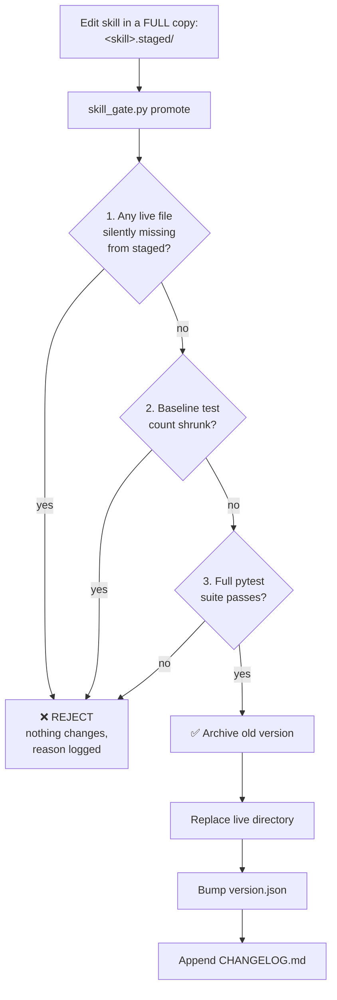
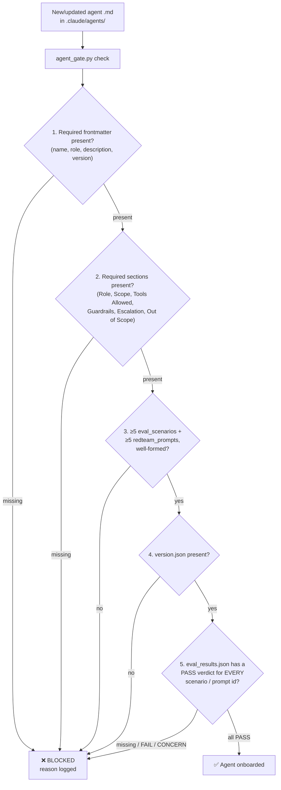
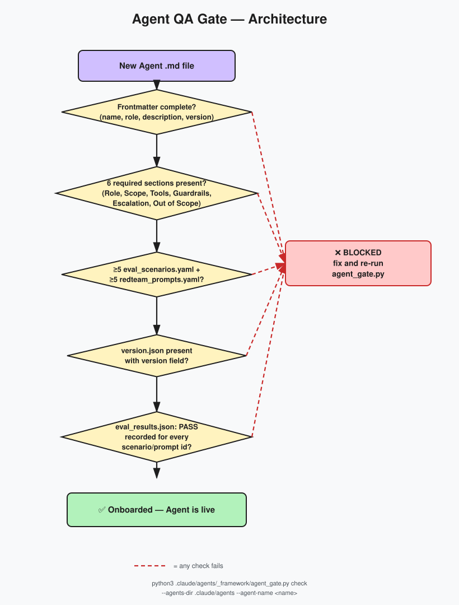
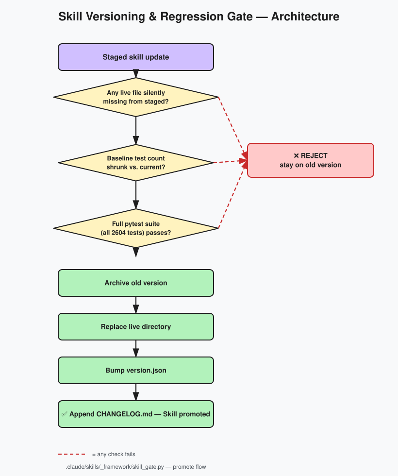

# 🏭 Digital Agent Factory

**Full-Time Equivalent (FTE) AI Agents with Reusable Intelligence — Building software through Spec-Driven, AI-Driven, and Test-Driven Development**

---

## 📋 Table of Contents

- [Overview](#overview)
- [How to Use This Repository](#-how-to-use-this-repository--get-the-most-out-of-it)
- [Development Methodologies](#development-methodologies)
- [How We Achieve Them](#how-we-achieve-them)
- [Agents](#agents)
- [Reusable Intelligence (Skills)](#reusable-intelligence-skills)
- [Methodology Integration](#methodology-integration)
- [Skill Versioning & Regression Gate](#%EF%B8%8F-skill-versioning--regression-gate--architecture-deep-dive)
- [Agent QA Gate](#-agent-qa-gate--architecture-deep-dive)
- [Visual Guides](#%EF%B8%8F-visual-guides)
- [Quick Start](#quick-start)
- [Directory Structure](#directory-structure)

---

## Overview

Digital Agent Factory is an **AI-powered development system** that combines specialized FTE (Full-Time Equivalent) agents with reusable intelligence skills. Instead of writing code manually, you describe what you need — and the right agents, armed with domain-specific skills, execute the work while enforcing best practices and compliance.

**Core Philosophy:**  
*Specify first. Plan then. Implement with skills. Test always.*

---

## 🚀 How to Use This Repository & Get the Most Out of It

### Who this is for

- **Solo developers / indie builders** who want spec-first, tested code without hiring a full team.
- **Small teams** who want consistent engineering practices (specs, contracts, tests, security review) enforced automatically instead of manually policed in every PR.
- **Anyone building their own "AI agent factory"** who wants a working reference implementation of FTE-style agents + reusable skills + versioning/QA gates, to copy or adapt.

### Prerequisites

- Claude Code (or another Claude runtime that supports custom agents/skills via `.claude/`).
- Python 3.10+ and `pytest` (used by the skill and agent QA gates, and by every skill's own test suite).
- Git, to clone the repo and to benefit from the versioning/archive workflow.

### Getting started, step by step

1. **Clone the repo** — or, if you already have a project, copy the `.claude/` folder into your project root. Everything the system needs (agents, skills, gates, docs) lives under `.claude/`.
2. **Open the project in Claude Code.** Claude automatically reads `.claude/CLAUDE.md` and discovers the agents in `.claude/agents/` and skills in `.claude/skills/`.
3. **Describe your task in plain language** and let the Orchestrator do the routing (see [Quick Start](#quick-start) below) — for example, *"Add JWT authentication to the API"*. Don't skip straight to hand-picking an agent for small tasks; letting the Orchestrator map skills and agents is what keeps specs, contracts, and tests consistent.
4. **Review the proposed plan before approving execution.** The Orchestrator shows which agents and skills it intends to use — this is your checkpoint to catch a wrong assumption before any code is written.
5. **Trust the output is already tested.** Every skill this system uses enforces TDD through `qa-engineer` / `edge-case-tester`, so a task isn't "done" until its tests pass — you're not signing up to write a separate test pass afterward.

### How to get the maximum benefit out of it

- **Start with the Orchestrator, not an agent.** The SDD loop (Specify → Plan → Tasks → Implement) feels slower on a two-line fix but pays for itself on anything with more than one moving part — half-skipping it is how specs and code drift apart.
- **Read [`.claude/CLAUDE.md`](.claude/CLAUDE.md) before extending anything.** It's this repo's constitution — what's gated, what isn't yet, the dos/don'ts/red-flags list, and the full incident writeup behind why the gates exist.
- **Treat the Skill Versioning Gate and Agent QA Gate as your safety net, not paperwork.** Before promoting a skill or onboarding a new agent, run `skill_gate.py` / `agent_gate.py` locally (see the [Skill Versioning & Regression Gate](#%EF%B8%8F-skill-versioning--regression-gate--architecture-deep-dive) and [Agent QA Gate](#-agent-qa-gate--architecture-deep-dive) sections above) — catching a regression on your machine is free; catching it in CI costs a round trip.
- **Reuse a skill before writing custom logic.** Browse `.claude/skills/` first — common needs (JWT auth, OpenAPI contracts, Kubernetes/cloud deploys, SEO, CI/CD, and more) already have a tested, versioned skill behind them.
- **Extend the system the same way it extends itself.** A new agent or skill should clear the same bar as everything already in the repo (required sections, eval scenarios, red-team prompts, a passing test suite) — copy an existing agent/skill as your template rather than starting from a blank file.
- **Let the two "live" agents work passively for you.** `live-skill-learner` captures fixes and improvements as you go and updates skills automatically; `live-change-management` tracks cross-file impact and propagates consistent updates — leave them running instead of manually keeping skills and docs in sync by hand.

---

## Development Methodologies

We achieve production-ready software through three integrated methodologies:

### 1. 📐 Spec-Driven Development (SDD)

**Definition:** No code is written until the specification is complete and approved. Requirements, architecture, and tasks are defined *before* implementation.

**The SDD Loop:**
```
Specify (WHAT) → Plan (HOW) → Tasks (BREAKDOWN) → Implement (CODE)
```

| Phase | File / Output | Purpose |
|-------|---------------|---------|
| **Constitution** | `speckit.constitution` | WHY — Principles, constraints, architecture values, security rules |
| **Specify** | `speckit.specify` | WHAT — Requirements, user journeys, acceptance criteria, domain rules |
| **Plan** | `speckit.plan` | HOW — Architecture, components, APIs, service boundaries |
| **Tasks** | `speckit.tasks` | BREAKDOWN — Atomic, testable work units with Task IDs |

**Rules Agents Must Follow:**
- Never generate code without a referenced Task ID
- Never modify architecture without updating `speckit.plan`
- Never propose features without updating `speckit.specify`
- If spec is missing → **Stop and request it**, do not improvise

---

### 2. 🤖 AI-Driven Development (AIDD)

**Definition:** Development is orchestrated by AI agents that analyze prompts, select the right specialists, invoke reusable skills, and coordinate execution — reducing manual decisions and human bottlenecks.

**How It Works:**
```
User Prompt → Orchestrator analyzes → Skills mapped → Agents assigned → Execution plan → Implementation
```

**Key Capabilities:**
- **Intent Detection** — Create, modify, test, deploy, debug, optimize
- **Automatic Routing** — Right agent for the right task (e.g., backend-developer for APIs, qa-engineer for tests)
- **Skill-First** — Agents use existing skills instead of manual implementation
- **Multi-Agent Coordination** — Complex features split across specialists and executed in sequence or parallel

---

### 3. 🧪 Test-Driven Development (TDD)

**Definition:** Tests are written or enforced before or alongside implementation. Quality is baked in through automation and edge-case coverage.

**How We Enforce It:**
- **QA Engineer Agent** — Runs test suites, validates quality
- **edge-case-tester Skill** — Identifies and covers edge cases
- **ab-testing Skill** — A/B test generation
- **production-checklist Skill** — Pre-deploy validation

**Integration:** Every implementation task has a corresponding test or validation step. Agents do not mark a feature complete until tests pass.

---

## How We Achieve Them

| Methodology | Achieved Via |
|-------------|--------------|
| **Spec-Driven Development** | `new-feature` skill (spec.md, plan.md, tasks.md), `api-contract-design` (OpenAPI first), `change-management` (spec updates before changes), Constitution enforcement in Orchestrator |
| **AI-Driven Development** | Orchestrator + 17 specialist/special FTE agents + `prompt-analyzer` skill + 59 reusable skills + automatic routing and delegation |
| **Test-Driven Development** | `qa-engineer` agent, `edge-case-tester` skill, `ab-testing` skill, `production-checklist` skill |

---

## Agents

Specialized FTE agents, each with clear roles and access to relevant skills.

### Master Orchestrator
| Agent | Role |
|-------|------|
| **orchestrator** | Analyzes every user prompt, maps to skills and agents, creates execution plans, and coordinates multi-agent workflows |

### Specialist Agents

| Agent | Role | Primary Skills |
|-------|------|----------------|
| **backend-developer** | APIs, auth, database integration | jwt-authentication, pydantic-validation, chatbot-endpoint, mcp-tool-builder |
| **frontend-developer** | UI/UX with React, Next.js | vercel-deployer, ab-testing, uiux-designer |
| **fullstack-architect** | System design, architecture | new-feature, change-management, skill-creator |
| **database-engineer** | Schema, migrations, optimization | database-schema-expander, connection-pooling, transaction-management |
| **devops-engineer** | Infrastructure, deployment, monitoring | deployment-automation, production-checklist, structured-logging |
| **security-engineer** | OWASP, auth, vulnerability testing | jwt-authentication, password-security, user-isolation, edge-case-tester |
| **qa-engineer** | Testing, quality assurance | edge-case-tester, ab-testing, production-checklist |
| **uiux-designer** | Interface and experience design | frontend-developer, ab-testing |
| **github-specialist** | Git, CI/CD, code review | change-management, production-checklist, deployment-automation |
| **vercel-deployer** | Vercel deployment, Next.js optimization | deployment-automation, production-checklist, performance-logger |
| **data-engineer** | Data pipelines, ETL, analytics | database-engineer, message-queue-integration, observability-apm |
| **technical-writer** | Docs, guides, API reference | api-docs-generator, frontend-developer, backend-developer |
| **cloud-architect** | AWS/GCP/Azure, Kubernetes | infrastructure-as-code, container-orchestration, observability-apm |
| **api-architect** | REST/GraphQL/gRPC, microservices | api-contract-design, graphql-api, microservices-patterns |
| **product-manager** | Requirements, roadmap, user stories | new-feature, change-management, fullstack-architect |

### Special Agents

| Agent | Role |
|-------|------|
| **live-skill-learner** | Captures fixes and improvements during development and updates skills automatically |
| **live-change-management** | Tracks code changes in real time, analyzes cross-file impact, and propagates consistent updates via the change-management skill |

---

## Reusable Intelligence (Skills)

Skills are reusable instructions and patterns that agents invoke. They encode best practices, edge cases, and domain knowledge.

### Categories

| Category | Examples |
|----------|----------|
| **Workflow & Planning** | new-feature, change-management, skill-creator, skill-learner, prompt-analyzer |
| **Core Implementation** | backend-developer, frontend-developer, database-engineer, fullstack-architect |
| **Security & Auth** | jwt-authentication, password-security, user-isolation |
| **Quality & Testing** | edge-case-tester, qa-engineer, ab-testing |
| **Infrastructure & Deployment** | deployment-automation, aws-eks-deploy, azure-aks-deploy, gcp-gke-deploy, vercel-deployer |
| **API & Design** | api-contract-design, api-docs-generator, graphql-api |
| **Observability** | structured-logging, performance-logger, observability-apm |

### How Skills Support SDD, AIDD, TDD

| Methodology | Supporting Skills |
|-------------|-------------------|
| **Spec-Driven** | `new-feature`, `api-contract-design`, `change-management` |
| **AI-Driven** | `prompt-analyzer`, `skill-creator`, `skill-learner` |
| **Test-Driven** | `edge-case-tester`, `qa-engineer`, `production-checklist` |

---

## Methodology Integration

End-to-end flow from idea to production:

```
┌─────────────────────────────────────────────────────────────────────────────┐
│  1. SPEC-DRIVEN (What & How First)                                          │
│  ─────────────────────────────────                                          │
│  User: "Build todo chatbot with auth"                                       │
│       → new-feature: spec.md, plan.md, tasks.md                             │
│       → api-contract-design: OpenAPI contract                               │
│       → Constitution check before any code                                  │
└─────────────────────────────────────────────────────────────────────────────┘
                                        │
                                        ▼
┌─────────────────────────────────────────────────────────────────────────────┐
│  2. AI-DRIVEN (Right Agents & Skills)                                       │
│  ─────────────────────────────────────                                      │
│  Orchestrator + prompt-analyzer                                             │
│       → Maps: backend-developer, database-engineer, security-engineer       │
│       → Invokes: jwt-authentication, chatbot-endpoint, database-schema      │
│       → Coordinates execution in sequence                                   │
└─────────────────────────────────────────────────────────────────────────────┘
                                        │
                                        ▼
┌─────────────────────────────────────────────────────────────────────────────┐
│  3. TEST-DRIVEN (Quality Built-In)                                          │
│  ───────────────────────────────────                                        │
│  qa-engineer + edge-case-tester                                             │
│       → Edge case coverage                                                  │
│       → production-checklist before deploy                                  │
│       → No sign-off until tests pass                                        │
└─────────────────────────────────────────────────────────────────────────────┘
                                        │
                                        ▼
┌─────────────────────────────────────────────────────────────────────────────┐
│  4. CONTINUOUS LEARNING (Skills Improve)                                    │
│  ───────────────────────────────────────                                    │
│  live-skill-learner captures fixes → skill-learner updates skills           │
│       → Same issues don't repeat                                            │
│       → Skills become more reliable over time                               │
└─────────────────────────────────────────────────────────────────────────────┘
```

---

## 🛡️ Skill Versioning & Regression Gate — Architecture Deep-Dive

In late 2026, an external reviewer's LinkedIn comment flagged a real risk in how
this repo's skills were being updated: letting an agent rewrite a skill's code
**and** its tests in the same pass makes it easy to mistake a weaker test for an
improvement. An audit confirmed it had already happened once
(`grafana-expert` / `prometheus-monitoring` — see `.claude/CLAUDE.md` for the
full incident writeup). The fix is now a permanent part of this repo's
architecture.

**The rule:** no skill's `scripts/tool.py` or `tests/` may be changed except by
promotion through `.claude/skills/_framework/skill_gate.py`, which enforces
three checks before anything live is touched:



**Why this matters for readers:** every skill in `.claude/skills/` now carries
its own `version.json`, `CHANGELOG.md`, `tests/test_tool.py`, and an
`_archive/` snapshot of every prior version — a skill's test suite can only
grow, never silently shrink, and every promotion is reversible. 59 skills have
been through this gate; 2604 tests pass repo-wide.

For the full incident writeup, the near-miss that led to an extra safeguard,
and a dos/don'ts/red-flags list for anyone (human or AI) working on this repo
next, see **[`.claude/CLAUDE.md`](.claude/CLAUDE.md)** and
**[`.claude/docs/skill-versioning-policy.md`](.claude/docs/skill-versioning-policy.md)**.

---

## 🤖 Agent QA Gate — Architecture Deep-Dive

The same "don't trust an unverified change" principle behind the skill
versioning gate above also applies to the 18 Digital FTE agent personas in
`.claude/agents/`. Unlike skills, an agent definition is a markdown
persona/instruction file consumed by an LLM at runtime — there is no code to
unit-test or mutate. So `.claude/agents/_framework/agent_gate.py` enforces a
structural + documented-evidence bar instead, and every agent must clear all
of it before it counts as onboarded:



**Why this matters for readers:** step 5 is the live-eval tier — every agent
is actually run in character against its own documented scenarios and
red-team prompts, graded against a stated `expected_behavior`, and recorded
per-id in `_meta/<agent>/eval_results.json`. A FAIL or CONCERN blocks the
gate until the agent definition itself is fixed and re-evaluated; nothing is
papered over by deleting or skipping a failing entry. All 18 agents in this
repo currently pass all 12 checks each (6 eval scenarios + 6 red-team
prompts) — 216 live-eval checks, all PASS. Run
`python3 .claude/agents/_framework/agent_gate.py check --agents-dir
.claude/agents --agent-name <name>` to re-verify any single agent, or see
**[`.claude/agents/README.md`](.claude/agents/README.md)** for the full
per-agent status table.

---

## 🖼️ Visual Guides

> Updated 2026-10-06 to cover both frameworks: the Agent QA Gate (new) and the Skill Versioning & Regression Gate (original). Each has its own slide deck and architecture diagram; the Agent QA Gate also has an explainer video.

| Format | Content | Link |
|--------|---------|------|
| Slide deck (Canva) | Agent QA Gate — the problem, the fix, rollout, result | [View on Canva](https://canva.link/i54hewlkk55ibcf) |
| Slide deck (Canva) | Skill Versioning & Regression Gate — the problem, the fix, promotion flow, scale | [View on Canva](https://canva.link/x5wbpd7u0t1rat8) |
| Explainer video (YouTube) | Agent QA Gate — the problem, the fix, rollout, result | [Watch on YouTube](https://youtu.be/M2g6wK_aavU) |

**Architecture diagrams** (SVG, saved in [`docs/architecture/`](docs/architecture/)):

**Agent QA Gate — 5-check onboarding flow**



**Skill Versioning & Regression Gate — 3-check promote flow**



---

## Quick Start

### 1. Invoke the Orchestrator (Recommended)

Describe your task in plain language. The Orchestrator will analyze, map skills, assign agents, and propose an execution plan:

```
User: "Add JWT authentication to the API"
→ Orchestrator analyzes
→ Assigns: backend-developer, security-engineer
→ Invokes: jwt-authentication, password-security, user-isolation
→ Waits for approval, then executes
```

### 2. Use Specific Agents

For direct control, invoke agents by name:

```
Use: /backend-developer — Implement API endpoints
Use: /qa-engineer — Run test suite
Use: /fullstack-architect — Design system architecture
```

### 3. Use Skills Directly

For targeted work:

```
/sp.new-feature — Scaffold spec, plan, tasks from a description
/sp.api-contract-design — Design OpenAPI contract
/sp.edge-case-tester — Add edge case tests
```

---

## Directory Structure

```
digital_factory/
├── .claude/
│   ├── CLAUDE.md               # Instructions for Claude working on this repo
│   ├── agents/                 # 18 FTE Agent definitions (.md persona files)
│   │   ├── orchestrator.md     # Master orchestrator
│   │   ├── backend-developer.md
│   │   ├── frontend-developer.md
│   │   ├── ...                 # 14 more specialist agents
│   │   ├── live-skill-learner.md
│   │   ├── live-change-management.md
│   │   ├── _framework/         # agent_gate.py — structural + live-eval QA gate
│   │   └── _meta/<agent>/      # eval_scenarios.yaml, redteam_prompts.yaml,
│   │                           # version.json, eval_results.json per agent
│   ├── skills/                 # 59 reusable skills
│   │   ├── new-feature/        # Spec scaffolding
│   │   ├── api-contract-design/# OpenAPI contracts
│   │   ├── jwt-authentication/
│   │   ├── ...                 # more skills, each with scripts/, tests/,
│   │   │                       # version.json, CHANGELOG.md
│   │   ├── _framework/         # skill_gate.py — versioning & regression gate
│   │   └── _archive/           # every prior version of every promoted skill
│   └── docs/                   # policy & reference docs
│
└── README.md                   # This file
```

---

## Benefits

| Benefit | How |
|---------|-----|
| **No Vibe Coding** | SDD ensures specs and tasks exist before code |
| **Consistent Quality** | Skills embed best practices; TDD enforces coverage |
| **Faster Development** | Right agents and skills are chosen automatically |
| **Compounding Intelligence** | live-skill-learner keeps skills improving |
| **Scalability** | New agents and skills can be added without changing core flow |

---

## Related Documents

- [Agents README](agents/README.md) — Full agent list and usage
- [40 AI Systems for Company](40_AI_Systems%20for%20company%20(must%20have).md) — Broader AI systems context
- [Wire Spec-KitPlus into Claude via MCP](Wire%20Spec-KitPlus%20into%20Claude%20via%20MCP.md) — MCP integration
- [Creating Agents](creating_agents_md.md) — Spec-Kit and agent workflow
- [.claude/CLAUDE.md](.claude/CLAUDE.md) — Full engineering instructions, plus the Skill Versioning & Regression Gate incident writeup, dos/don'ts, blacklist, greylist, and red flags for anyone working on this repo next
- [.claude/docs/skill-versioning-policy.md](.claude/docs/skill-versioning-policy.md) — The versioning policy in full

---

**Digital Agent Factory** — Spec first. Plan then. Implement with skills. Test always. 🚀
